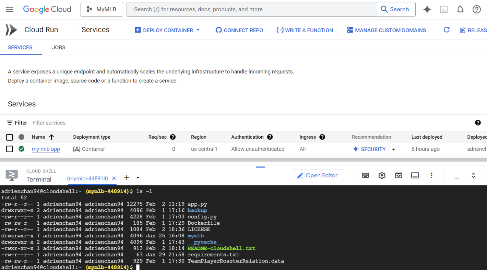
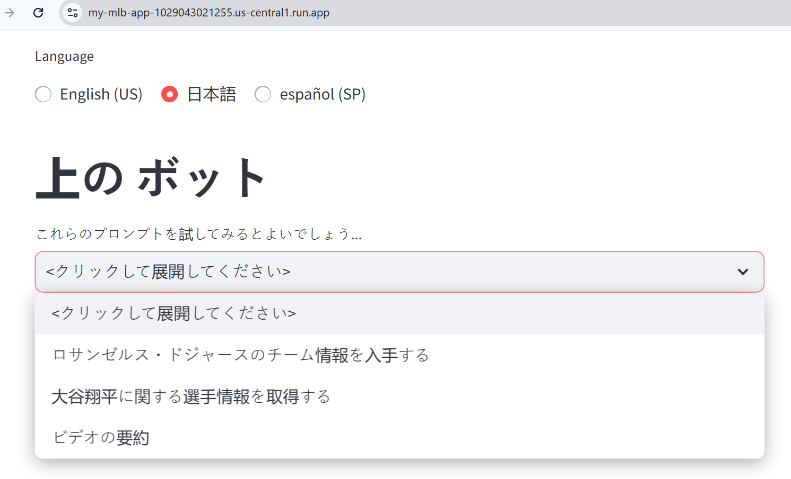
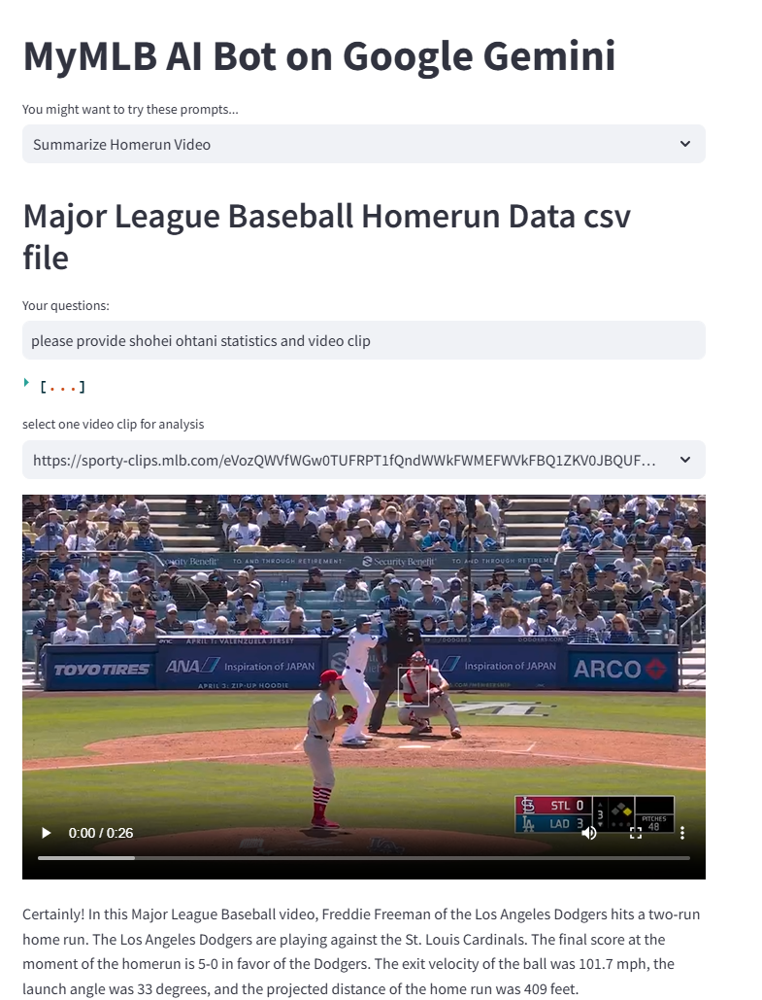
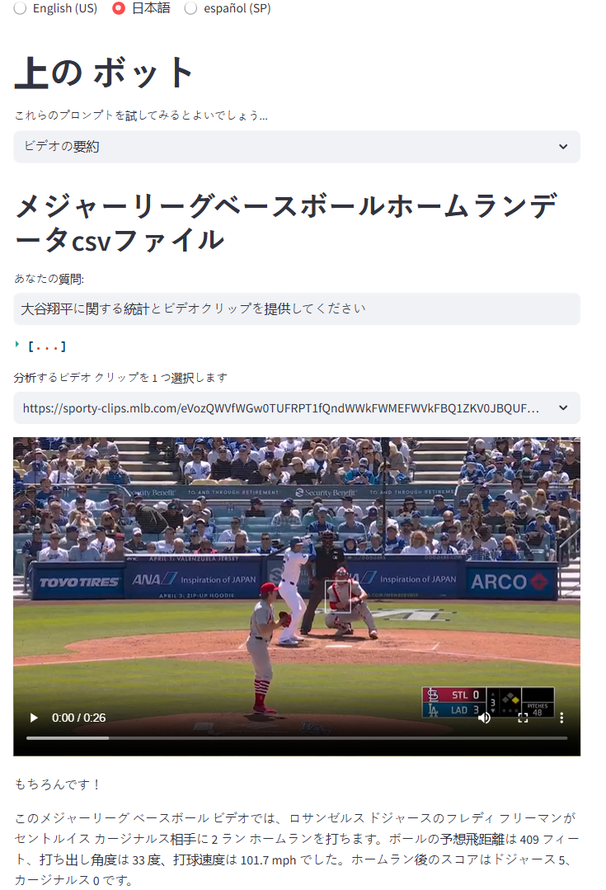

# MyMLB Chatbot application based on **Google Cloud** Technologies : **Google Gemini Vertex AI**, **Cloud Run**, **Cloud Storage** to leverage **Major League Baseball** Data

|           |                                                |
| --------- | ---------------------------------------------- |
| Author(s) | [Adrien Chan](https://github.com/lorcie) |

**MyMLB Project** is a Chatbot developed in **Python** and **GenerativeAI Custom Instructions** with **Google Cloud** Technologies : **Google Gemini Vertex AI** Generative LLM, hosting with **Google Cloud Run**, storing with **Google Cloud Storage**, online developer IDE **Google Cloud Shell**,  and uses also the [Streamlit](https://streamlit.io/) framework to leverage **Major League Baseball** Data (Team, Player, Homerun).

# MyMLB Solution Principles


- The application has been developed/deployed/tested using various **Google Cloud** Technologies ( **Cloud Run** , **Cloud Storage**,..) enabling **serverless** strategy through Cloud Shell (Terminal/Command Line or Editor)

- The application has been designed to **externalize** the Data (MLB Homerun and Translations in csv format) outside of the Code Repository to make easy and flexible their evolutions in the future.

- The various Gemini models associated either with **custom prompt instructions** either **function calling tools** heve been created based on **Singleton Entity Pattern** to get better performance

- **Team Player Roaster Relation Metadata**  dynamically integrated in one of LLM custom system instruction have been defined as environment variable to enable potential future evolution outside of the code repo, hence its future modification can be integrated without cloud build submission command

- **Gemini Model** environment variable enables easy switch from **gemini-1.5-flash-002** into **gemini-2.0-flash-exp** , and also integration of other model version in the future

# MyMLB Local Review

### Clone MyMLB Repository 
Clone the repository about MyMlb application and Go inside the working Directory locally.

### Store Data csv files in some Google Cloud Storage
Before building and deploying the cloned application, you have to create a **Google Cloud Storage** Bucket and upload the following csv files availablke in subdirectory data :

- 2024-mlb-homeruns-sample.csv : extract of 2024 MLB Homerun dataset

- text_bundle.csv : Dictionary of Translations into spanish, japanese internaional languages

### Local Deployment (Cloud Shell)
Note: Before proceeding, make sure to Navigate to the folder as your active working directory.

Set up the Python virtual environment and install dependencies:

```bash
python3 -m venv mymlb
source mymlb/bin/activate
pip install -r requirements.txt
```

### Set environment variables:
**GCP_PROJECT:** Your Google Cloud project ID.**

**GCP_REGION:** The region where you deploy your Cloud Run app (e.g., us-central1).

**GCS_HOMERUN:** MLB homerun csv file on Google Cloud Storage

**GCS_TEXT_BUNDLE:** Dictionary of Translations Settings for international languages> spanish, japanese

**TEAM_PLAYER_ROASTER_RELATION:** Team Players Roaster Metadata

```bash
export GCP_PROJECT='<Your GCP Project Id>'  # Replace with your project ID

export GCP_REGION='us-central1'             # Modify if needed

export GCS_HOMERUN=gs://<Your_GCS_Id>/2024-mlb-homeruns-sample.csv

export GCS_TEXT_BUNDLE=gs://<Your_GCS_Id>/text_bundle.csv

export TEAM_PLAYER_ROASTER_RELATION=`cat TeamPlayerRoasterRelation.data`


```
### Run the application locally:
```
streamlit run app.py \
  --browser.serverAddress=localhost \
  --server.enableCORS=false \
  --server.enableXsrfProtection=false \
  --server.port 8080
```
Access the application URL provided in Cloud Shell's web preview or open it in your browser.
Build and Deploy to Cloud Run

### Set up environment variables for Cloud Run:

**GCP_PROJECT:** Your Google Cloud project ID.

**GCP_REGION:** The region where you deploy your Cloud Run app (e.g., us-central1).

**GCS_HOMERUN:** some MLB homerun csv file on Google Cloud Storage (see prerequesites section above)

**GCS_TEXT_BUNDLE:** Dictionary of Translations Settings for international languages> spanish, japanese (see prerequesites section above)

**TEAM_PLAYER_ROASTER_RELATION:** Team Players Roaster Metadata

```bash
export GCP_PROJECT='<Your GCP Project Id>'  # Replace with your project ID

export GCP_REGION='us-central1'             # Modify if needed

export GCS_HOMERUN=gs://<Your_GCS_Id>/2024-mlb-homeruns-sample.csv

export GCS_TEXT_BUNDLE=gs://<Your_GCS_Id>/text_bundle.csv

export TEAM_PLAYER_ROASTER_RELATION=`cat TeamPlayerRoasterRelation.data`

```


### When needed (if not yet exist) create the Artifactory and docker configuration:

```bash
export AR_REPO='<REPLACE_WITH_YOUR_AR_REPO_NAME>'  # Replace with your Artifact Registry repo name, mine is my-mlb-ar-repo
export SERVICE_NAME='<SOME_SERVICE_NAME>' # I have set my value 'my-mlb-app'
```

Run the two following command:

```
gcloud artifacts repositories create "$AR_REPO" --location="$GCP_REGION" --repository-format=Docker
gcloud auth configure-docker "$GCP_REGION-docker.pkg.dev"
```

### Build the Docker image and push it to Artifact Registry:

Run the following command:

```
gcloud builds submit --tag "$GCP_REGION-docker.pkg.dev/$GCP_PROJECT/$AR_REPO/$SERVICE_NAME"
```
### Deploy the service to Cloud Run:

Run the following command:

```bash
gcloud run deploy "$SERVICE_NAME" \
  --port=8080 \
  --image="$GCP_REGION-docker.pkg.dev/$GCP_PROJECT/$AR_REPO/$SERVICE_NAME" \
  --allow-unauthenticated \
  --region=$GCP_REGION \
  --platform=managed \
  --project=$GCP_PROJECT \
  --set-env-vars=GCP_PROJECT=$GCP_PROJECT,GCP_REGION=$GCP_REGION \
  --set-env-vars=GCS_HOMERUN=$GCS_HOMERUN,GCS_TEXT_BUNDLE=$GCS_TEXT_BUNDLE,GEMINI_MODEL=$GEMINI_MODEL \
  --set-env-vars="TEAM_PLAYER_ROASTER_RELATION=$TEAM_PLAYER_ROASTER_RELATION"

```

# MyMLB Assets

MyMLB on Google Cloud Run >


MyMLB on Google Cloud Shell >



MyMLB on Google Cloud Shell Editor >


MyMLB on Google Cloud Storage >


MyMLB Welcome in English >


MyMLB Welcome in Japanese >



MyMLB Welcome in Spanish >


MyMLB Homerun Video Summarize in English >



MyMLB Homerun Video Summarize in Japanese >



MyMLB Homerun Video Summarize in Spanish >


# MyMLB Cloud Run public Command

For my project , the Cloud Run generated command for my environment has been following url:
https://my-mlb-app-1029043021255.us-central1.run.app

Upon successful deployment, access the provided clound run specific URL (available at end of logs) to explore the newly deployed Cloud Run application. Congratulations!


